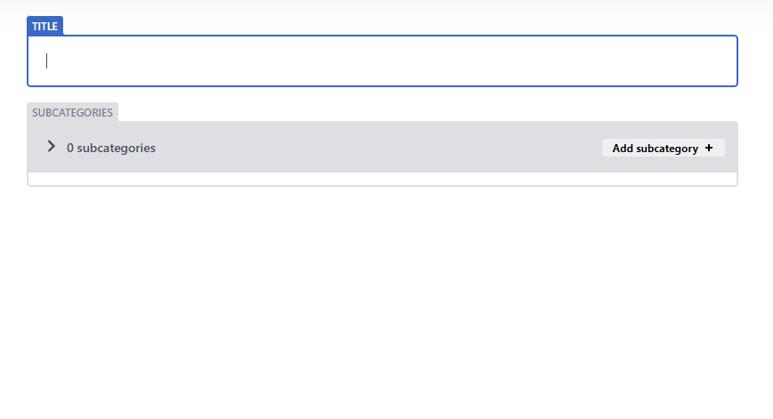
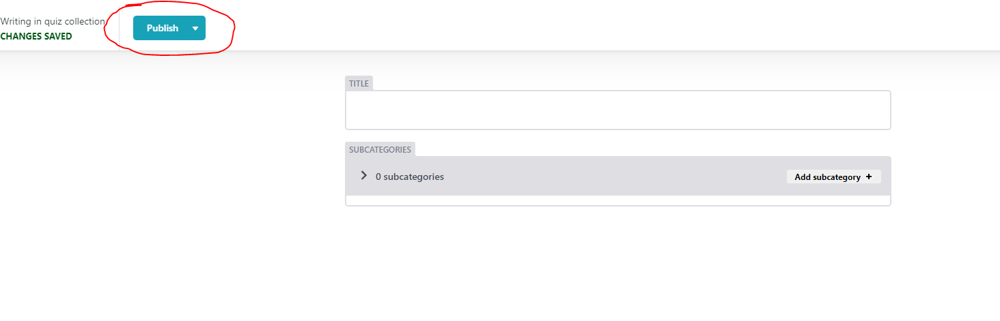
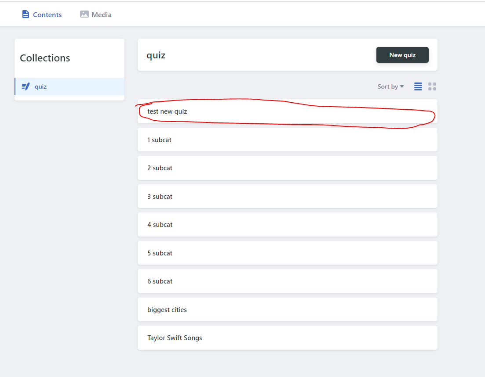
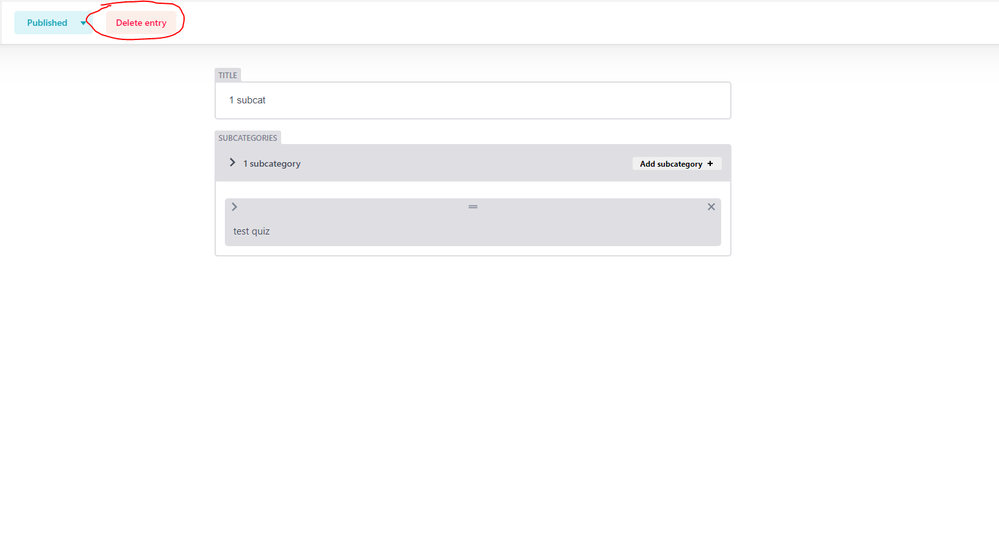
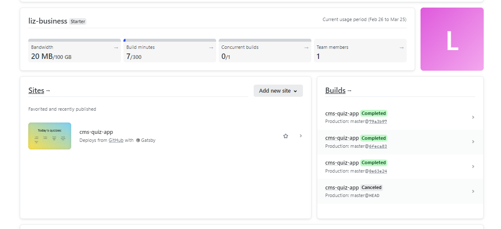

# 
Content Editable Web Quiz App

Quiz Game app with content customization.

- [First time access](#s1-1)
- [Editing content](#s1-2)
  - [Adding a quiz](#s1-2-1)
  - [Editing a quiz](#s1-2-2)
  - [Deleting a quiz](#s1-2-3)
- [Limitations / features / issues](#s1-3)
  - [Netlify](#s1-3-1)
  - [Known issues](#s1-3-2)
  - [Multiple same values](#s1-3-3)
  - [Netlify admin panel](#s1-3-4)
- [Dev notes](#s1-4)

## 
First time access

App is currently visible at:

> https://cms-quiz-app.netlify.app/

and admin panel:

> https://cms-quiz-app.netlify.app/admin/

## 
Editing content

WARNING: All content edition actions, after clicking "Publish", or "Delete" will trigger site update command, and use a part of Netlify's build limit.

### 
Adding a quiz

go to the development website `/admin` url:

(at the time of writing):

> https://cms-quiz-app.netlify.app/admin/

Click new Quiz:

Fill out the required fields:

Click "Publish":

### 
Editing a quiz

In main admin panel, click on a quiz to edit:

Change fields value, and click "Publish"

### 
Deleting a quiz

## 
Limitations / features / issues

### 
Netlify

Netlify in free plan has around 300 build minutes / month.

This allows for around 100-150 content alterations (100-150 site update commands).

Usual site update time is around 1-2min.

### 
Known issues

#### 
Minor string format limitation

Where entering a string which seems like an hour format (for example "2:56"), it is being recognized as number
and might prevent site from updating.

Best is to avoid hour-like strings, as values set in admin panel fields.

This could be workedaround by adding a " " (space) or a letter to the string.

### 
Multiple same values

At the time of writing it is best to avoid same values for subcategories within a quiz, or same answers values per quiz (also same answers in different subcategories of the same quiz are not currently supported).

### 
Netlify admin panel

To enter the Website's hosting provider go to:

https://app.netlify.com/

and click "Log in with email"

Credentials to the account will be provided in another file.

On the main dashboard page, you can see information like remaining build minutes or bandwidth used:

Under "Builds", you can also see the status of latest-triggered website updates.

## 
Dev notes

Project is build with Gatsby and Decap CMS.

To run the project locally for further development refer to the above framework providers.

### Local development

> gatsby develop

and in another terminal, run server for local backend:

> npx decap-server
