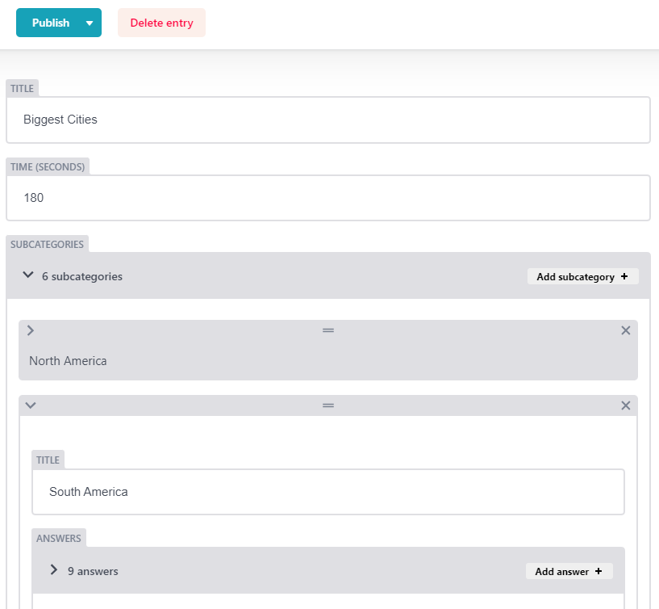

# 
Content Editable Web Quiz App

## Table of contents

- [Features](#s0-1)
- [First time access](#s1-1)
- [Editing content](#s1-2)
  - [Adding a quiz](#s1-2-1)
  - [Editing a quiz](#s1-2-2)
  - [Deleting a quiz](#s1-2-3)
- [Limitations](#s1-3)
  - [Netlify](#s1-3-1)
  - [Multiple same values](#s1-3-2)
  - [Minor string format limitation](#s1-3-3)
- [Dev notes](#s1-5)
  - [Local development](#s1-5-1)
- [ Further options](#s1-6)
- [ Copyrights](#s1-7)
- [ Authors](#s1-8)

## 
Features

App is statically built during build process thanks to which doesn't require any api calls which speeds up the website access.

To store content, a Git based CMS was chosen, thanks to which APP does not require any additional backend code or hosting.

https://decapcms.org/docs/intro/

## 
First time access

App is currently visible at:

> https://cms-quiz-demo.netlify.app/

and admin customization panel:

> https://cms-quiz-demo.netlify.app/admin/

for demo purposes, registration is set to open and doesn't require email confirmation.

you can use also a test user:

email: test1@test.com
password: test1

## 
Editing content

WARNING: All content edition actions, after clicking "Publish", or "Delete" will trigger site update command, using part of Netlify's build limit. Feel free to test. Limit is however around 100-150 actions per month, something to take into account.

### 
Adding a quiz

go to the development website `/admin` url:

> https://cms-quiz-demo.netlify.app/admin/

Click new Quiz:

Fill out the required fields:

Click "Publish":

### 
Editing a quiz

In main admin panel, click on a quiz to edit:

Change fields value, and click "Publish"

### 
Deleting a quiz

## 
Limitations

### 
Netlify

Netlify in free plan has around 300 build minutes / month.

This allows for around 100-150 content alterations (100-150 site update commands).

Usual site update time is around 1-2min after a Publish.

### 
Multiple same values

Multiple same values for answers / subcategories inside single quiz are not supported.

### 
Minor string format limitation

Adding a time-like string (f.e. 3:45) as title may result in the field being considered a number for some reason and prevent site build. This can be worked around by adding a " " (space) sign to the string.

This is most likely a Decap CMS issue.

## 
Dev notes

Project is build with Gatsby and Decap CMS.

In case of need, it is best to refer to the above framework providers.

### 
Local development

> gatsby develop

and in another terminal, run server for local backend:

> npx decap-server

**warning: this is an important step, as without it changes in local admin panel will result in remote repository update**

## 
 Further options

With Decap CMS it is possible to upload files as content. This opens door for possibilities like for example quizzes having a customized "banner-image" set by content editors.

## 
 Copyrights

I hereby prohibit from re-distributing, copying, reselling, or re-using the code or its parts in any form.

The code is made public only for demonstration purposes.

## 
 Authors

Tomasz Kożuch

kozuch.tomasz1@gmail.com

https://github.com/tkozuch/
